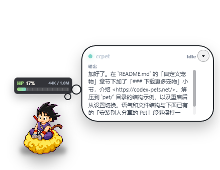

# ClaudePet（Fork 增强版）

> 本仓库是 [**liuchenlili/ClaudePet**](https://github.com/liuchenlili/ClaudePet) 的 Fork，在原版基础上修了几个 HiDPI 拖动相关的 bug、把界面做了进一步汉化、把通知体系按事件类型重做了一遍，并补充了启动时的 stale state 自动清理。
>
> 所有改动只覆盖渲染层、主进程的窗口/通知逻辑与少量配置项，未改动 `bridge / hook / statusline / pet manifest` 等原有协议；卸载逻辑与原版兼容。
>
> 本项目仅用于技术研究学习之用，请勿用于商业用途，所以项目不会做任何适配！只保证在笔者手机上是可以正常运行的，代码开源，有问题或者建议欢迎提issues。
>
> 详细改动可见 [`docs/CHANGELOG.md`](docs/CHANGELOG.md)。

Claude Code 桌面宠物。通过 Claude Code 的 `statusLine` 和 `hooks` 把会话状态、上下文用量、git 状态、token 消耗、任务进度、需要注意的提示等显示在一个 Electron 小窗口里。支持 Windows / macOS / Linux。

---

## 截图

**桌面常驻窗口** — 桌宠 + HP 条 + 气泡输出



**展开面板** — 实时 token、会话 ID、git 状态、本次花费等


**设置中心 · 宠物** — 切换、预览、可视化编辑 manifest


**设置中心 · 使用统计** — 按今日 / 7 天 / 30 天 / 全部，分项目和分日期的 token / 花费汇总


---

## 本 Fork 相对原版的改动

> 下列改动**已合并到主线代码**，不再是可选项。每条都给出了原因 / 影响。

### 1. 拖动桌宠时窗口"越来越大"的修复（真凶）

**现象**：在 Windows + 系统缩放（DPI 125% / 150%）下，反复拖动桌宠会让悬浮窗口逐次横向放大，宠物 sprite 因受限于 `applyFrame({ fit: true })` 大小基本不变，看上去就像"和气泡越来越远"。

**根因**：原版主进程拖动处理器是

```js
const [x, y] = petWindow.getPosition();
petWindow.setPosition(x + dx, y + dy, false);
```

在 HiDPI 下 `setPosition` 走的 DIP → 物理像素换算每次会产生亚像素误差；叠加 `resizable: true`，反复调用累计放大。即便改成 `setBounds` 并显式带宽高，**如果宽高是从 `getBounds()` 回读**，依然会形成 438 → 438.x → 439 → 440 的反馈循环。

**修复**（`src/main/main.js`）：

- 文件顶部固化窗口尺寸常量 `PET_WINDOW_WIDTH = 438; PET_WINDOW_HEIGHT = 338;`，全场唯一真相
- 拖动处理器**只回读 position（x, y），宽高用常量**，断掉反馈循环
- `BrowserWindow` 构造加 `minWidth/minHeight/maxWidth/maxHeight + resizable: false` 作为双保险
- 启动时 `applyWindowConfig()` 还原位置的逻辑也统一用常量、改 `setPosition` → `setBounds`
- 顺手把 `window.setPointerCapture?.(event.pointerId)` 的错误调用修正为 `event.target.setPointerCapture(...)`（原版那行因为 `Window` 上没有此方法是无效的，会导致拖动时鼠标短暂滑出窗口后跳动）

### 2. 应用菜单中文化

原版 Electron 默认菜单是英文（File / Edit / View / Window / Help → Minimize / Zoom / Close...）。Fork 后在 `src/main/main.js` 新增 `buildAppMenu()`，按平台（mac / 非 mac）构造完整中文菜单：

- 「文件」打开设置中心 / 退出
- 「编辑」撤销 / 重做 / 剪切 / 复制 / 粘贴 / 删除 / 全选
- 「视图」重新加载 / 强制重新加载 / 切换开发者工具 / 实际大小 / 放大 / 缩小 / 切换全屏
- 「窗口」最小化 / 缩放 / 关闭（mac 下额外有"前置全部窗口"等）
- 「帮助」打开项目主页

在 `boot()` 里调用 `Menu.setApplicationMenu(buildAppMenu())` 全局生效。使用 `role` 字段保留 Electron 标准行为，通过 `label` 覆写显示文本。

### 3. 通知体系按事件类型重做

**原版**：所有 `status.attention === true` 的事件走同一个 `maybeNotify`，没法按"完成 / 等权限 / 出错"分别开关。

**本 Fork**：

- `src/shared/config.js` 的 `notifications` 新增三个分类开关：
  ```js
  notifications: {
    system: true,         // 总开关
    sound: false,
    flashWindow: true,
    onComplete: true,     // Claude 完成时通知
    onPermission: true,   // 等待权限 / 输入时通知
    onError: true         // 出错时通知
  }
  ```
- `maybeNotify` 重写为基于 `notificationCategory(status)` 的分类调度：
  - `kind === "completed"` → `onComplete`
  - `kind === "waiting-permission" / "waiting-input" / "notification"` → `onPermission`
  - `kind === "error" / "tool-error"` 或 `severity === "error"` → `onError`
- 通知标题加 `[完成] / [需要交互] / [出错]` 前缀，便于在通知中心一眼分辨
- 通知支持**点击激活**：点一下系统通知会自动唤起桌宠 + 打开设置中心
- 新增 IPC `claudepet:test-notification(category)`：在设置里就能模拟一次真实通知通道
- 新增 IPC `claudepet:reset-status`：一键把会话/状态字段清空（保留 cost / usage / git 等历史统计）
- 「显示设置」拆出独立的「通知设置」section：6 个开关 + 3 个测试按钮（完成 / 权限 / 出错）+ 1 个「重置当前显示」按钮

### 4. 启动时自动清理 stale state

**原版**：`state.json` 是全局共享的，最后一次发事件的项目会冻在那儿；切到新项目后桌宠气泡会一直显示**上一个项目的旧目录 / 旧输出**，直到新项目的 hook 触发为止。

**本 Fork**：`src/main/main.js` 新增 `clearStaleState()`，在 `boot()` 最前面调用：

- 若 `state.updatedAt` > **30 分钟前** → 视为过期
- 或 `state.session.cwd` 指向的目录已不存在 → 视为残留
- 满足任意一条就把 `session.cwd / session.id / status` 等会话字段重置成 idle，**保留 cost / context / tokens / git / usage / history** 等统计

如果自动清理没识别到，可以在设置里手动点「重置当前显示」按钮。

### 5. 拖动奔跑动画提供开关

原版拖动时强制切换到 `pet.animations.run`；Fork 后在 `src/shared/config.js` 加 `runOnDrag`（默认 `true` 保持原版行为），「显示设置」加同名开关，可一键关掉让桌宠在拖动期间保持当前姿势。

### 6. 其他小修

- 修正 `pointerdown` 内 `setPointerCapture` 的错误调用（同 #1 末尾）
- 设置中心顶部的应用菜单完全中文化（同 #2）

---

## 前置要求

- Node.js 18+（Electron 42 要求）
- Claude Code（CLI / Desktop / IDE 扩展任一）

---

## 下载与安装

有两种方式拿到 ClaudePet：

### 方式 A：从 GitHub 克隆（本 Fork）

```bash
git clone https://github.com/CharleyLeo/ClaudePet2.git
cd ClaudePet
npm install
```

> 也可以克隆原版 [`liuchenlili/ClaudePet`](https://github.com/liuchenlili/ClaudePet)，但**本 Fork 的拖动稳定性 / 通知分类 / stale state 自动清理 等功能仅本仓库有**。

### 方式 B：下载发布包

从本 Fork 的 GitHub Releases 下载 ZIP，解压后进入 ClaudePet 目录：

```bash
cd <ClaudePet>
npm install
```

`npm install` 只把依赖（主要是 `electron`）装到当前 `node_modules`，**不做任何全局安装**。

> ⚠️ **不要装完后移动 ClaudePet 目录** — 集成时会把 ClaudePet 的绝对路径写进 Claude Code 的 `settings.json`，目录搬走了就失效，需要重新 install。

记下当前 ClaudePet 路径，下文用 `<ClaudePet>` 占位（例：`D:\code\ClaudePet` 或 `~/code/ClaudePet`）。

---

## 验证桌宠能独立启动

```bash
npm start
```

应该看到桌宠窗口出现在屏幕上。从系统托盘 → 退出 关掉即可。
此时尚未与 Claude Code 集成，状态不会变化。

---

## 与 Claude Code 集成（三选一）

### 方案 A：全局生效（推荐）

所有项目都会自动唤起桌宠。

```bash
cd <ClaudePet>
npm run install:user
```

写入 `~/.claude/settings.json`（Windows 是 `%USERPROFILE%\.claude\settings.json`），原文件会被备份成 `settings.json.claudepet-backup-<时间戳>`。

> ⚠️ `--preserve-statusline` 选项的语义是"备份原 statusLine 以便 uninstall 时还原"，**不是"安装时不动 statusLine"**。如果你之前用 `claude-hud` 等其他 statusline 插件，install 会覆盖它。需要保留原 statusline 的话，从备份文件里恢复 `statusLine` 字段（保留 `hooks` 字段不动）即可。

### 方案 B：仅 ClaudePet 项目自身使用

```bash
cd <ClaudePet>
npm run install:local
```

写入 `<ClaudePet>/.claude/settings.local.json`，只对 ClaudePet 仓库本身生效。

### 方案 C：只让某个其他项目使用

进到目标项目，调用 ClaudePet 的绝对路径：

```bash
cd <你的目标项目>
node D:\coding\ClaudePet\bin\claudepet.js install --scope local --preserve-statusline
# D:\coding\ClaudePet 替换为你本机的 ClaudePet 仓库路径
```

写入目标项目的 `.claude/settings.local.json`（git 默认忽略，不会污染团队配置）。

> ⚠️ **不要直接** `npm run install:local`：那条命令的 cwd 是 ClaudePet 仓库自己（`src/cli.js:177`），会装错地方。

---

## 启动桌宠

集成后，桌宠会在 Claude Code 第一次触发 statusLine 或 hook 时**自动 spawn**，无需手动启动。

也可以提前打开：

```bash
cd <ClaudePet>
npm start
```

桌宠是**单实例**的（`app.requestSingleInstanceLock()`），多个 Claude Code 窗口、不同项目共用同一只宠物。

---

## 常用命令

```bash
node <ClaudePet>/bin/claudepet.js doctor       # 显示 home、runtime 端口、Electron 路径、可用宠物
node <ClaudePet>/bin/claudepet.js pets         # 列出可用宠物
node <ClaudePet>/bin/claudepet.js start        # 等同 npm start
node <ClaudePet>/bin/claudepet.js --help       # 全部命令
```

PowerShell 用户可以加个简写。在 `$PROFILE` 里：

```powershell
function claudepet { node D:\path\to\ClaudePet\bin\claudepet.js @args }
```

之后直接 `claudepet doctor`、`claudepet install --scope local` 等。

---

## 卸载

```bash
cd <ClaudePet>
npm run uninstall:user      # 移除全局集成
npm run uninstall:local     # 移除 ClaudePet 自身项目的集成
```

卸载某个目标项目：

```bash
cd <你的目标项目>
node <ClaudePet>/bin/claudepet.js uninstall --scope local
```

卸载会从 settings.json 中移除 ClaudePet 注入的 statusLine 和 hooks，并尽可能恢复原 statusLine（如果安装时 `--preserve-statusline` 保存过）。备份文件保留在原位置不会自动删。

完全清除：再删除 `~/.claudepet/` 目录和那些 `*.claudepet-backup-*` 备份即可。

---

## 故障排查

| 现象 | 检查 |
|---|---|
| 桌宠不出现 | `claudepet doctor` 看 `runtime` 字段；显示 `not running` 就 `npm start` 手动启动 |
| statusLine 没变化 | 看 `~/.claude/settings.json` 的 `statusLine.command` 是否包含 `claudepet.js`，被其他工具覆盖了就重装 |
| 状态长时间停在 idle | hook 没装齐。settings 的 `hooks` 块应该有 15 个事件每个都含 claudepet 条目，重装即可 |
| 改了 ClaudePet 目录位置 | 路径是写死的，搬动后必须重新 install |
| 多窗口/多项目重复弹窗 | 不会，单实例锁会让第二个进程立刻退出 |
| 拖动时窗口横向越来越大 | 本 Fork 已修；如果你用的是原版仓库或老版本，参见上文「拖动桌宠时窗口"越来越大"的修复」 |
| 切换项目后气泡显示旧目录内容 | 重启 ClaudePet 触发 `clearStaleState()` 自动清，或设置 → 通知设置 → 「重置当前显示」 |
| 完成 / 权限 / 出错没收到通知 | 设置 → 通知设置，按对应「测试」按钮验证通道；总开关「启用系统通知」要开；确认 hooks 已装到正确 scope |

---

## 集成做了什么（深入了解）

`install --scope user` 等价于：

1. 备份 `~/.claude/settings.json` → `settings.json.claudepet-backup-<时间戳>`
2. 把原 `statusLine`（若不是 ClaudePet）保存为 ClaudePet 的 `legacyStatusLine`，桌宠收到 statusLine 时会代为转发它的输出
3. 改写 `statusLine.command` 为 `node <ClaudePet>/bin/claudepet.js statusline`
4. 给以下 15 个 hook 各追加一条 `node <ClaudePet>/bin/claudepet.js hook` 命令（如尚未存在）：
   ```
   UserPromptSubmit, PermissionRequest, Notification,
   PreToolUse, PostToolUse, PostToolUseFailure, PostToolBatch,
   SubagentStart, SubagentStop, TaskCreated, TaskCompleted,
   Stop, StopFailure, PreCompact, PostCompact
   ```
   全部 `async: true; timeout: 5`，不会阻塞 Claude Code。
5. ClaudePet 自己的配置存在 `~/.claudepet/`（`config.json` / `state.json` / `runtime.json`），可用环境变量 `CLAUDEPET_HOME`、`CLAUDE_HOME` 自定义。

---

## 自定义宠物

`pet/<id>/` 目录下放：

- `pet.json`（manifest）
- `spritesheet.webp`

manifest 支持 `frameWidth`、`frameHeight`、`columns`、`rows`、`defaultScale`、`anchor`，以及七种动画：`idle`、`thinking`、`tool`、`waiting`、`success`、`error`、`run`。

桌宠系统托盘 → 打开设置 可视化编辑、切换宠物。内置三只宠物 `ikkun` / `clawd` / `nimbus` 的 spritesheet 是 `1536x1872`，按 `192x208` 帧 `8x9` 网格切分。

### 下载更多宠物

到 <https://codex-pets.net/> 选喜欢的宠物，下载得到一个 ZIP（里面是一个含 `pet.json` 和 `spritesheet.webp` 的文件夹）。

直接解压到 ClaudePet 的 `pet/` 目录下：

```text
<ClaudePet>/
  pet/
    <下载的宠物文件夹>/
      pet.json
      spritesheet.webp
```

然后重启 ClaudePet，托盘 → 打开设置 → 「宠物」页面就能看到并切换。

### 安装别人分享的 Pet

别人分享 Pet 时，通常会给你一个文件夹或 ZIP。确认解压后结构类似：

```text
your-pet/
  pet.json
  spritesheet.webp
```

把整个 `your-pet/` 文件夹放到 ClaudePet 的 `pet/` 目录下：

```text
<ClaudePet>/
  pet/
    your-pet/
      pet.json
      spritesheet.webp
```

然后重启 ClaudePet，或从托盘打开设置，在「宠物」页选择新 Pet。

### 分享自己的 Pet

只需要打包 `pet/<id>/` 这个单独文件夹。文件夹名就是 Pet 的唯一 ID；`pet.json` 里的 `spritesheetPath` 默认指向同目录下的 `spritesheet.webp`。

---

## 桌宠展示什么

- **上下文容量**：使用百分比、窗口大小、实时 token
- **会话**：id、cwd、模型、Claude Code 版本、花费、用时
- **token**：实时 input/output、来自 transcript 的整 session 累计
- **git**：分支、dirty/staged/untracked/ahead/behind
- **任务状态**：idle、thinking、running tool、waiting permission、waiting input、subagent running、task created/completed、completed、error、compacting

权限请求、输入提示等需要"注意"的状态会高亮气泡并触发系统通知（本 Fork 已按事件类型拆分成 `onComplete / onPermission / onError` 三个独立开关）。

---

## 开发与测试

```bash
npm test         # 运行所有测试
npm run dev      # Electron 开发模式
```

测试覆盖 install/uninstall、状态机、宠物 manifest、transcript 解析等。

---

## 上线前功能审查

发布前建议按这张清单走一遍：

- 准备 GitHub Releases 下载包（本 Fork 仓库：`https://github.com/CharleyLeo/ClaudePet2`）。
- `npm install` 后运行 `npm test`，确认 install/uninstall、状态机、宠物 manifest、transcript 解析都通过。
- 运行 `npm start`，检查桌宠窗口、托盘菜单、设置中心「宠物 / 显示设置 / 使用统计」三个页签。
- 运行 `node bin/claudepet.js doctor` 和 `node bin/claudepet.js pets`，确认 runtime、Electron 路径和内置宠物都可读。
- 测试 `npm run install:user` 或 `npm run install:local`，确认 Claude Code 的 `statusLine` 和 15 个 hooks 写入成功。
- 把一个外部 Pet 文件夹复制到 `pet/<id>/`，重启后确认能在设置中心选择并播放七种动画。
- 测试权限请求、等待输入、工具失败、Stop 完成等状态，确认气泡高亮、系统通知和动画切换符合预期。
- **本 Fork 额外项**：在 HiDPI 屏（125% / 150%）反复拖动桌宠 50 次以上，窗口宽高应稳定不变；在设置中心点三个「测试通知」按钮分别验证三类通知；切换不同项目后启动桌宠，确认 `clearStaleState` 自动清理旧目录数据。

---

## 致谢

- 原作者 [**liuchenlili**](https://github.com/liuchenlili) 与原版仓库 [**liuchenlili/ClaudePet**](https://github.com/liuchenlili/ClaudePet)：本 Fork 的所有基础架构、桌宠 sprite、设置中心、bridge / hook / statusline / 使用统计 等核心功能全部来自原版；Fork 只是在此之上做了几个 bug 修复和 UX 增强。强烈建议先看原版的 README 与代码结构。
- 感谢 [linux.do](https://linux.do/) 社区在开发过程中提供的反馈、讨论和灵感。
- 感谢 [Claude Code](https://claude.com/claude-code) —— 整套 statusLine / hooks 体系是 ClaudePet 能存在的前提，大量代码也是在 Claude Code 协助下完成的。

---

## License

MIT（沿用原版协议）
